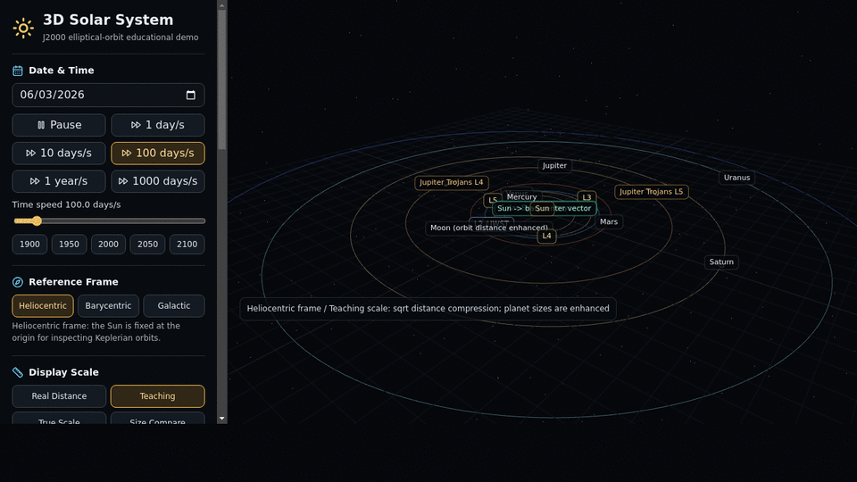

# Scientific Solar System Demo

A browser-based 3D solar-system visualization built with Vite, React, TypeScript, and Three.js.



This project is designed to be closer to an interactive planetarium exhibit than a typical "planets on circular rails" animation. It uses approximate J2000 orbital elements, Keplerian ellipses, orbital inclinations, barycentric motion, Moon motion, Lagrange points, Jupiter Trojan swarms, true-scale views, and a galactic reference frame.

It is still an educational visualization, not a professional ephemeris engine. The goal is to make the real geometry of the Solar System understandable without pretending to replace NASA SPICE, JPL Horizons, or high-precision n-body integrations.

## Features

- 3D Keplerian orbits for the eight major planets.
- J2000 ecliptic reference plane with visible orbital inclinations.
- Heliocentric, barycentric, and galactic reference frames.
- Solar-system barycenter marker and Sun wobble visualization.
- Sun-to-barycenter vector overlay.
- Real distance, teaching-compressed, true-scale, and size-comparison display modes.
- Size comparison mode with true radius ratios and a minimum visible display radius.
- Tooltips for real radius, display radius, and display scale factor.
- Simplified Earth-Moon system.
- Sun-Earth L1-L5 markers, including a JWST label near L2.
- Jupiter Trojan swarms near Jupiter L4 and L5.
- Galactic-frame trail visualization with approximate solar motion at 220 km/s.
- Time warp presets and date jumps.
- Inclination display amplification for side-view teaching.
- Gravity visualization layers:
  - equipotential shells
  - volumetric field
  - distorted 3D spatial grid
  - exaggerated gravitational-lensing arcs
- Chinese and English celestial-body labels.
- Layer controls with hover explanations.

## Demo Modes

The application has four display modes:

- **Real Distance**: `1 AU = 100 Three.js units`. Planet sizes are visually enhanced because true radii would be too small to inspect.
- **Teaching Compression**: orbital directions remain 3D, but distance is compressed using a square-root scale. This keeps the whole system readable.
- **True Scale**: distance and body radii use the same scale. Most planets become extremely small, which is the point.
- **Size Comparison**: hides orbits and compares the Sun and planets by radius. The Sun may extend beyond the screen so the inner planets remain visible.

## Quick Start

```bash
npm install
npm run dev
```

Then open the local Vite URL, usually:

```text
http://127.0.0.1:5173/
```

Build for production:

```bash
npm run build
```

Preview the production build:

```bash
npm run preview
```

## Demo GIF

The README preview is a 10-frame English slideshow GIF. Each frame is 100 simulated days after the previous one, and the UI is set to `100 days/s`:

```bash
mkdir -p /tmp/solar-gif-100days

for i in $(seq 0 9); do
  d=$(date -u -d "2026-06-03 +$((i * 100)) days" +%F)
  n=$(printf "%02d" "$((i + 1))")
  google-chrome --headless=new --disable-gpu --no-sandbox --enable-unsafe-swiftshader \
    --screenshot=/tmp/solar-gif-100days/frame-${n}.png \
    --window-size=1280,720 --timeout=10000 \
    "http://127.0.0.1:5173/?mode=teaching&lang=en&speed=100&notes=0&date=${d}"
done

convert -delay 100 -loop 0 -resize 960x540 /tmp/solar-gif-100days/frame-*.png -layers Optimize assets/demo.gif
```

Run the dev server first with `npm run dev`. The `notes=0` parameter hides the explanatory panel so the orbital scene stays visible.

## URL Parameters

You can open specific modes directly:

```text
/?frame=galactic&mode=teaching&view=all
/?frame=barycentric&mode=realDistance&view=side
/?mode=trueScale&view=all
/?mode=teaching&view=side&tilt=20
/?frame=galactic&mode=teaching&trail=100
/?mode=teaching&gravity=equipotential
/?mode=teaching&gravity=lensing
/?mode=sizeComparison
/?mode=sizeComparison&fullSun=1
/?mode=teaching&lang=en
/?mode=teaching&lang=zh
```

Supported query values include:

- `mode`: `realDistance`, `teaching`, `trueScale`, `sizeComparison`
- `frame`: `heliocentric`, `barycentric`, `galactic`
- `view`: `inner`, `outer`, `all`, `top`, `side`
- `gravity`: `none`, `equipotential`, `volume`, `spatialGrid`, `lensing`
- `lang`: `zh`, `en`
- `date`: initial date as `YYYY-MM-DD`
- `speed`: initial time speed in simulated days per second, from `0` to `1000`
- `tilt`: inclination display multiplier from `1` to `50`
- `trail`: galactic trail duration in years from `1` to `1000`
- `fullSun`: `1` or `true` to show the full Sun in size-comparison mode
- `inner`: `1` or `true` to prioritize the inner planets in size-comparison mode
- `notes`: `0` or `false` to hide the explanatory reality-notes panel

## Scientific Model

Planetary elements are stored in `src/data/planetElements.ts`. They are low-precision mean orbital elements commonly used for approximate Solar System visualization, referenced to the J2000 ecliptic and equinox.

For a given date, the application converts time to Julian Date and computes:

```ts
T = (JD - 2451545.0) / 36525
```

Each orbital element is updated from its J2000 value using a linear rate per Julian century. The planet position is then computed from Kepler's equation:

```ts
M = L - varpi
M = E - e * sin(E)
xPrime = a * (cos(E) - e)
yPrime = a * sqrt(1 - e * e) * sin(E)
```

`solveKepler` uses Newton-Raphson iteration with a convergence threshold of `1e-10`. The orbital-plane coordinates are rotated into the J2000 ecliptic coordinate frame using:

```text
Rz(Omega) * Rx(i) * Rz(omega)
```

where:

- `Omega` is longitude of ascending node.
- `i` is inclination.
- `omega = varpi - Omega` is argument of perihelion.

The scene convention is:

- X-Y plane: J2000 ecliptic plane
- Z axis: orbital inclination direction

## Barycentric Motion

The solar-system barycenter is computed as a mass-weighted average:

```ts
barycenter = sum(m_i * r_i) / sum(m_i)
```

The Sun's approximate offset relative to the barycenter is:

```ts
sunPosition = -sum(m_planet * r_planet) / M_sun
```

The UI can amplify this offset so the Sun's wobble is visible. This display amplification does not change the orbital calculation.

## Moon, Lagrange Points, and Trojans

The Moon uses a simplified geocentric elliptical orbit with an average distance of about `384,400 km`, eccentricity about `0.0549`, and inclination about `5.145 deg` relative to the ecliptic. In teaching modes, the Moon's orbital distance may be visually enhanced so users can see the Earth-Moon hierarchy.

Sun-Earth L1-L5 are shown using first-order circular restricted three-body approximations. `L2 / JWST` marks the approximate Sun-Earth L2 region used by the James Webb Space Telescope. It is not a precise JWST ephemeris.

Jupiter Trojans are rendered as deterministic point clouds near Jupiter L4 and L5, about 60 degrees ahead of and behind Jupiter. These are visual swarms, not cataloged asteroid positions.

## Galactic Frame

The galactic reference frame uses an approximate solar motion of `220 km/s` around the Milky Way center. The current Sun position is kept near the center of the scene so the trail remains inspectable.

Planetary trails in this mode show that heliocentric orbits are not closed paths in a galactic frame. For readability, the transverse orbit radius in the trail visualization is enhanced; this is clearly a display aid, not a change to the underlying orbital model.

## Gravity Visualization

The project intentionally avoids the common 2D rubber-sheet funnel model. Instead, the Gravity Visualization menu provides 3D educational layers:

- **Equipotential shells**: transparent spherical shells for levels of `V proportional to -GM/r`.
- **Volume field**: translucent concentric volumes showing gravitational potential falloff.
- **3D spatial grid**: a cubic grid gently compressed toward the Sun, suggesting that gravity affects space in all directions.
- **Gravitational lensing**: exaggerated arcs near the Sun to illustrate light deflection, historically associated with the 1919 eclipse observations.

These layers are visual explanations of physical ideas. They are not a rendering of four-dimensional spacetime, and they do not feed back into the orbit calculation.

## Project Structure

```text
src/
  astro/
    moon.ts              Simplified Moon orbit
    orbit.ts             Keplerian orbit and barycenter math
    time.ts              Julian Date and date helpers
  components/
    ControlPanel.tsx     UI controls
    SolarSystemScene.tsx Three.js scene
  data/
    planetElements.ts    Planet constants and orbital elements
  App.tsx                Application state and layout
  styles.css             Global UI and scene styles
  types.ts               Shared TypeScript types
```

## Limitations

This project does not currently use:

- NASA SPICE kernels
- JPL Horizons queries
- numerical n-body integration
- relativistic orbit corrections
- real spacecraft ephemerides
- cataloged Trojan asteroid coordinates
- high-precision lunar theory

Those would be the next step toward a professional astronomy visualization tool. This project deliberately stays lightweight enough to run in a browser with no backend.

## Contributing

Contributions are welcome. Useful directions include:

- higher-quality textures for planets and rings
- better label placement and collision avoidance
- more precise Moon and spacecraft ephemerides
- event markers for conjunctions, oppositions, and transits
- improved accessibility and keyboard controls
- optional SPICE or Horizons integration behind a separate data layer
- tests for orbital math and UI state behavior

Please keep display aids clearly labeled. The project should distinguish real orbital geometry from visual amplification.

## License

MIT. See [LICENSE](./LICENSE).
